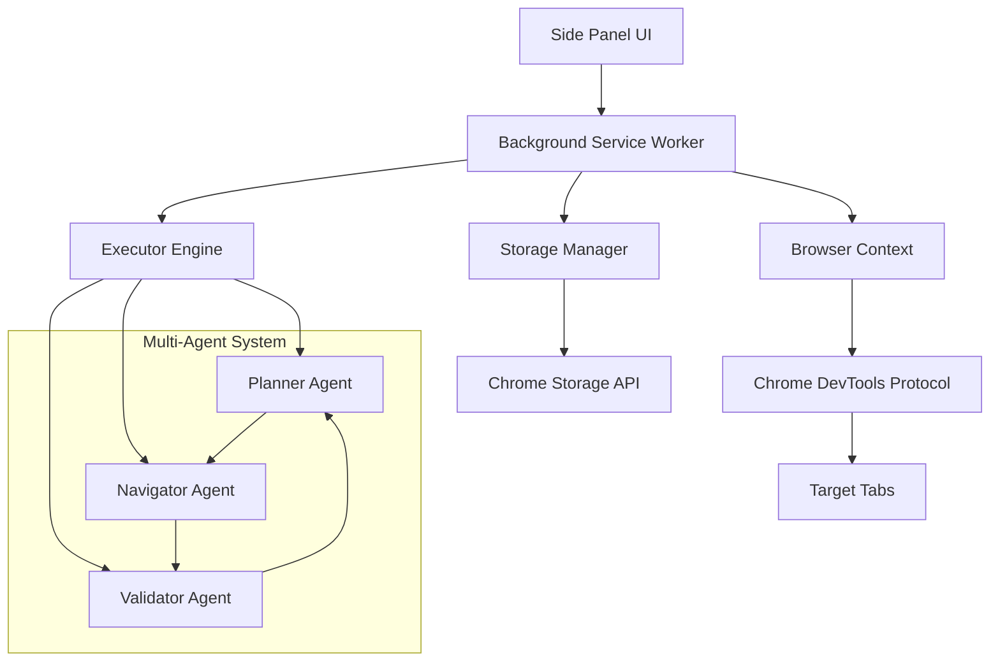

# Nanobrowser - 企业级 AI 网页自动化框架

<div align="center">
  
</div>

<div align="center">

[](https://opensource.org/licenses/Apache-2.0)
[](https://nodejs.org/)
[](https://www.typescriptlang.org/)
[](https://pnpm.io/)

[English](README.md) | **中文** | [Discord](https://discord.gg/NN3ABHggMK) | [文档](https://deepwiki.com/nanobrowser/nanobrowser)

</div>

## 🏗️ 技术架构概览

Nanobrowser 是一个基于多智能体架构的企业级 AI 网页自动化框架，采用 Chrome Extension Manifest V3 规范构建。核心采用事件驱动的分布式智能体协作模式，实现了高度可扩展和容错的自动化执行引擎。

### 核心架构组件



### 智能体协作机制

#### 1. 规划智能体 (Planner Agent)
- **职责**: 高级任务分解、策略制定、执行路径规划
- **技术实现**: 基于大语言模型的推理引擎，支持复杂任务的递归分解
- **关键特性**: 动态规划调整、容错恢复、上下文感知决策

#### 2. 导航智能体 (Navigator Agent)
- **职责**: DOM 操作、页面交互、元素识别与操作
- **技术实现**: 基于 Chrome DevTools Protocol 的底层浏览器操作
- **关键特性**: 智能元素定位、视觉理解、异步操作处理

#### 3. 验证智能体 (Validator Agent)
- **职责**: 任务执行结果验证、质量控制、异常检测
- **技术实现**: 多维度验证策略，支持语义和结构双重验证
- **关键特性**: 自适应验证阈值、渐进式验证、错误分类

## 🔧 技术栈详解

### 前端技术栈
```typescript
// 主要技术栈
React 18.3.1          // UI 框架
TypeScript 5.5.4      // 类型系统
Vite 6.3.5            // 构建工具
Tailwind CSS 3.4.17   // 样式框架
```

### 后端 & 扩展架构
```typescript
// Chrome Extension APIs
chrome.runtime.*      // 消息传递和生命周期管理
chrome.debugger.*     // DevTools Protocol 集成
chrome.sidePanel.*    // 侧边栏管理
chrome.storage.*      // 数据持久化

// 核心依赖
@langchain/core       // LLM 抽象层
webextension-polyfill // 跨浏览器兼容性
zod                   // 运行时类型验证
```

### Monorepo 架构

```
nanobrowser/
├── chrome-extension/          # 核心扩展逻辑
│   ├── src/background/       # Service Worker & 智能体引擎
│   │   ├── agent/           # 多智能体系统
│   │   │   ├── agents/      # 具体智能体实现
│   │   │   ├── actions/     # 原子操作定义
│   │   │   ├── executor.ts  # 执行引擎
│   │   │   └── types.ts     # 类型定义
│   │   ├── browser/         # 浏览器上下文管理
│   │   └── services/        # 核心服务
│   └── manifest.js          # 扩展清单生成
├── pages/                   # React 应用集合
│   ├── side-panel/         # 主要用户界面
│   ├── options/            # 设置页面
│   └── content/            # 内容脚本
├── packages/               # 共享包
│   ├── storage/           # 数据层抽象
│   ├── shared/            # 通用工具
│   └── ui/                # UI 组件库
└── turbo.json             # Turborepo 配置
```

## 🚀 快速开始

### 环境要求
```bash
Node.js >= 22.12.0
pnpm >= 9.15.1
Chrome/Edge >= 88
```

### 开发环境搭建

```bash
# 1. 克隆仓库
git clone https://github.com/nanobrowser/nanobrowser.git
cd nanobrowser

# 2. 安装依赖
pnpm install

# 3. 启动开发模式
pnpm dev

# 4. 构建生产版本
pnpm build

# 5. 生成分发包
pnpm zip
```

### 扩展加载与调试

```bash
# Chrome 开发者模式加载
1. 打开 chrome://extensions/
2. 启用"开发者模式"
3. 点击"加载已解压的扩展程序"
4. 选择 dist/ 目录

# Firefox 调试模式
pnpm build:firefox
# 访问 about:debugging 加载临时扩展
```

## 📋 开发指南

### 智能体开发模式

#### 1. 自定义智能体实现
```typescript
// 继承基础智能体类
export class CustomAgent extends BaseAgent<CustomOutputSchema> {
  constructor(options: BaseAgentOptions) {
    super(customOutputSchema, options, {
      id: 'custom_agent',
      toolCallingMethod: 'auto'
    });
  }

  async execute(): Promise<AgentOutput<CustomResult>> {
    // 实现具体的智能体逻辑
    const result = await this.invoke(messages);
    return {
      id: this.id,
      result: result
    };
  }
}
```

#### 2. 动作(Action)扩展机制
```typescript
// 定义原子操作
export const clickAction = z.object({
  action: z.literal('click'),
  coordinate: z.tuple([z.number(), z.number()]).optional(),
  element_id: z.number().optional(),
});

// 注册到动作构建器
ActionBuilder.register('click', clickAction, async (params, page) => {
  return await page.click(params.element_id, params.coordinate);
});
```

#### 3. 事件系统集成
```typescript
// 订阅智能体事件
executor.subscribeExecutionEvents(async (event: AgentEvent) => {
  switch (event.state) {
    case ExecutionState.STEP_START:
      console.log(`智能体 ${event.actor} 开始执行步骤`);
      break;
    case ExecutionState.STEP_OK:
      console.log(`步骤执行成功`);
      break;
    case ExecutionState.STEP_FAIL:
      console.error(`步骤执行失败: ${event.data?.details}`);
      break;
  }
});
```

### 浏览器上下文管理

#### 1. 高级调试器集成
```typescript
// 获取浏览器上下文
const browserContext = new BrowserContext({
  allowedUrls: ['https://example.com/*'],
  deniedUrls: ['https://ads.example.com/*'],
  minimumWaitPageLoadTime: 2.0,
  displayHighlights: true
});

// 标签页管理
const page = await browserContext.switchTab(tabId);
const screenshot = await page.takeScreenshot();
const state = await browserContext.getState(includeScreenshot);
```

#### 2. DOM 状态管理
```typescript
// 构建可交互元素树
const elementTree = await page.buildElementTree({
  includeAttributes: ['title', 'aria-label', 'placeholder'],
  maxDepth: 10,
  filterClickable: true
});

// 元素高亮显示
await page.highlight(elementId, { color: '#ff0000', duration: 3000 });
```

### LLM 提供商集成

#### 1. 多提供商配置
```typescript
// 支持的 LLM 提供商
const providers = {
  openai: { apiKey: 'sk-...', baseURL: 'https://api.openai.com/v1' },
  anthropic: { apiKey: 'sk-ant-...', baseURL: 'https://api.anthropic.com' },
  gemini: { apiKey: 'AI...', baseURL: 'https://generativelanguage.googleapis.com' },
  ollama: { baseURL: 'http://localhost:11434' },
  groq: { apiKey: 'gsk_...', baseURL: 'https://api.groq.com/openai/v1' }
};
```

#### 2. 智能体模型分配策略
```typescript
// 性能优化配置
const agentModels = {
  [AgentNameEnum.Planner]: { 
    provider: 'anthropic', 
    model: 'claude-3-sonnet-20240229' 
  },
  [AgentNameEnum.Navigator]: { 
    provider: 'openai', 
    model: 'gpt-4o' 
  },
  [AgentNameEnum.Validator]: { 
    provider: 'anthropic', 
    model: 'claude-3-haiku-20240307' 
  }
};
```

## ⚡ 性能优化与监控

### 1. 智能体执行优化
```typescript
// 执行引擎配置
const agentOptions: AgentOptions = {
  maxSteps: 100,                    // 最大步骤数
  maxActionsPerStep: 10,            // 每步最大操作数
  maxFailures: 3,                   // 最大失败次数
  maxValidatorFailures: 3,          // 验证器最大失败次数
  retryDelay: 10,                   // 重试延迟(秒)
  maxInputTokens: 128000,           // 最大输入令牌数
  useVision: true,                  // 启用视觉模式
  planningInterval: 3               // 规划间隔
};
```

### 2. 内存和资源管理
```typescript
// 资源清理策略
class ResourceManager {
  private contexts = new Map<string, BrowserContext>();
  
  async cleanup(taskId: string) {
    const context = this.contexts.get(taskId);
    if (context) {
      await context.cleanup();
      this.contexts.delete(taskId);
    }
  }
  
  // 内存监控
  async getMemoryUsage() {
    const memInfo = await chrome.system.memory.getInfo();
    return {
      available: memInfo.availableCapacity,
      capacity: memInfo.capacity
    };
  }
}
```

### 3. 错误处理与恢复
```typescript
// 智能重试机制
class SmartRetryManager {
  async executeWithRetry<T>(
    operation: () => Promise<T>,
    maxRetries: number = 3,
    backoffMs: number = 1000
  ): Promise<T> {
    for (let i = 0; i < maxRetries; i++) {
      try {
        return await operation();
      } catch (error) {
        if (i === maxRetries - 1) throw error;
        
        const delay = backoffMs * Math.pow(2, i);
        await this.delay(delay);
        
        console.warn(`操作失败，${delay}ms 后重试 (${i + 1}/${maxRetries})`);
      }
    }
    throw new Error('重试次数已用尽');
  }
}
```

## 🔐 安全性与合规

### 1. 数据隐私保护
```typescript
// 本地数据加密
class SecureStorage {
  private encryptionKey: CryptoKey;
  
  async storeSecurely(key: string, data: any) {
    const encrypted = await crypto.subtle.encrypt(
      { name: 'AES-GCM', iv: crypto.getRandomValues(new Uint8Array(12)) },
      this.encryptionKey,
      new TextEncoder().encode(JSON.stringify(data))
    );
    
    return chrome.storage.local.set({ [key]: encrypted });
  }
}
```

### 2. 权限最小化原则
```json
// Chrome Extension 权限配置
{
  "permissions": [
    "sidePanel",
    "storage",
    "activeTab",
    "debugger"
  ],
  "host_permissions": [
    "http://*/*",
    "https://*/*"
  ],
  "optional_permissions": [
    "microphone"
  ]
}
```

### 3. 内容安全策略
```json
{
  "content_security_policy": {
    "extension_pages": "script-src 'self'; object-src 'self'; connect-src 'self' https://api.openai.com https://api.anthropic.com;"
  }
}
```

## 🧪 测试策略

### 1. 单元测试
```typescript
// Jest + Testing Library
describe('NavigatorAgent', () => {
  it('should execute click action correctly', async () => {
    const mockPage = createMockPage();
    const agent = new NavigatorAgent(testOptions);
    
    const result = await agent.execute();
    
    expect(result.success).toBe(true);
    expect(mockPage.click).toHaveBeenCalledWith(123);
  });
});
```

### 2. 端到端测试
```typescript
// Playwright 集成测试
test('complete automation workflow', async ({ page, context }) => {
  await page.goto('https://example.com');
  
  // 加载扩展
  const extensionId = await loadExtension(context);
  
  // 执行自动化任务
  const result = await executeTask('点击登录按钮并填写表单');
  
  expect(result.status).toBe('success');
});
```

### 3. 性能基准测试
```typescript
// 性能监控
class PerformanceMonitor {
  async measureExecutionTime(taskId: string) {
    const start = performance.now();
    
    await this.executeTask(taskId);
    
    const end = performance.now();
    const duration = end - start;
    
    return {
      taskId,
      duration,
      timestamp: Date.now()
    };
  }
}
```

## 📈 监控与运维

### 1. 执行监控
```typescript
// 实时监控仪表板
interface ExecutionMetrics {
  totalTasks: number;
  successRate: number;
  averageExecutionTime: number;
  errorDistribution: Map<string, number>;
  resourceUsage: {
    memory: number;
    cpu: number;
    network: number;
  };
}
```

### 2. 日志管理
```typescript
// 结构化日志
const logger = createLogger('nanobrowser', {
  level: 'info',
  format: 'json',
  transports: [
    new ChromeStorageTransport(),
    new ConsoleTransport()
  ]
});

logger.info('任务执行开始', { 
  taskId, 
  agentType: 'navigator',
  timestamp: Date.now() 
});
```

## 🤝 贡献指南

### 开发流程
1. Fork 项目并创建功能分支
2. 遵循 TypeScript 严格模式和 ESLint 规则
3. 编写全面的单元测试和集成测试
4. 提交 PR 前运行完整的测试套件

### 代码规范
```bash
# 代码质量检查
pnpm lint          # ESLint 检查
pnpm type-check    # TypeScript 类型检查  
pnpm prettier      # 代码格式化
pnpm test          # 运行测试套件
```

### 提交规范
```bash
# 使用 Conventional Commits
feat: 添加新的智能体类型支持
fix: 修复浏览器上下文内存泄漏
docs: 更新 API 文档
test: 添加集成测试用例
refactor: 重构执行引擎架构
```

## 📄 许可证

本项目采用 [Apache License 2.0](LICENSE) 开源许可证。

---

**🌟 如果这个项目对您有帮助，请给我们一个 Star！**

[⭐ GitHub](https://github.com/nanobrowser/nanobrowser) | [💬 Discord](https://discord.gg/NN3ABHggMK) | [🐦 Twitter](https://x.com/nanobrowser_ai)